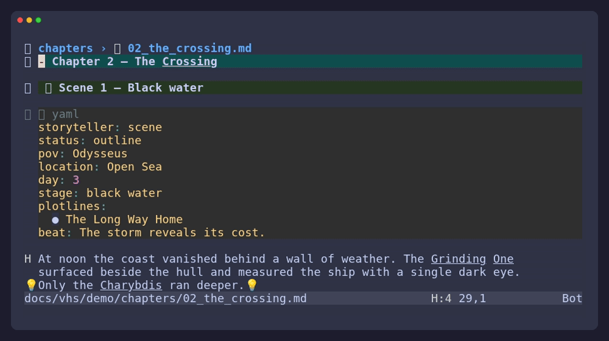
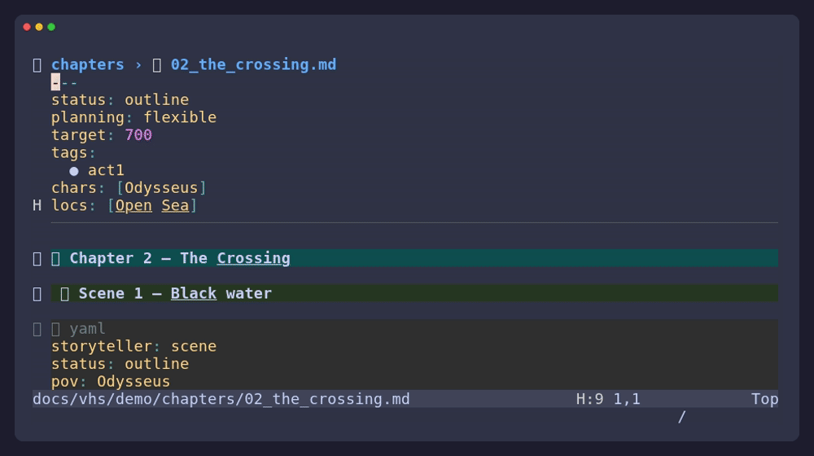

# Storyteller Language Server

`storyteller-lsp` is an optional language server for Storyteller projects. It
adds context while you write: names in prose can lead to reference cards,
completion can suggest project vocabulary, and diagnostics can point out
unfinished connections.

The LSP-based approach is heavily inspired by
[markdown-oxide](https://github.com/Feel-ix-343/markdown-oxide). That project
demonstrates how much more natural Markdown navigation, completion, references,
and rename become when they are provided through Neovim's native LSP interface.
Storyteller carries that approach into a story-aware model: scenes, aliases,
prose names, plot threads, and reference-card types.

The server is written for stories rather than generic Markdown. It reads the
same `chapters/`, `references/`, and scene metadata that the Neovim plugin uses.
It is an independent implementation with its own project model; the
markdown-oxide influence is architectural and inspirational, not a runtime
dependency.

## Install And Start

The server binary must be available as `storyteller-lsp`. If it is already on
your `PATH`, add this to your Neovim configuration:

```lua
vim.lsp.config("storyteller", {
  cmd = { "storyteller-lsp" },
  filetypes = { "markdown" },
  root_markers = { ".storyteller", ".git" },
})
vim.lsp.enable("storyteller")
```

`storyteller-lsp` is the reference implementation of the open
[Storyteller standard](https://github.com/AlejandroGomezFrieiro/storyteller),
which also defines the project format and the CLI contract. The standard
repo's Nix flake exposes the binary as `packages.<system>.storyteller-lsp`;
this plugin's flake re-exposes it. Other editor integrations can launch the
same executable over standard input and output — see
`spec/editor-integrations.md` in the standard repo.

The client attaches to Markdown buffers under a project root. Root detection
prefers an explicit `.storyteller` marker, then a Storyteller-style layout, and
finally a git root.

## Why It Helps

Reference cards are useful, but constantly switching away from prose breaks a
writing rhythm. The language server keeps the connection nearby:

- Write names naturally; no special link syntax is required.
- Jump from a name to its card with `gd`.
- See a card summary with `K`.
- Find every mention with `gr`.
- Rename a primary name across its card and chapters.
- Create a card for a name that does not have one yet.


## What It Reads

On startup, save, and watched-file changes, the server indexes:

| Content | Location | Details |
| --- | --- | --- |
| Reference cards | `references/<type>/*.md` | Every subfolder is a reference type. |
| Primary names | Card heading | Text before `—`, `–`, or `:` is used. |
| Aliases | Card `names:` frontmatter | Each alias can resolve in prose. |
| Summaries | Card `- **…**` bullets | Shown in hover results. |
| Chapters | `chapters/*.md` | Used for names and mentions. |
| Scenes | `storyteller: scene` YAML blocks | Used for metadata and links. |

Names are matched case-insensitively after punctuation normalization. Single,
two-word, and three-word names are supported. A card like this is enough:

```markdown
---
names:
  - Captain Greg
  - Greg
---

## Captain Greg

- **Role:** harbor master
- **Notes:** Knows every ship in the bay.
```

## Reference Types

Any directory below `references/` is a type. The built-in directories are
`characters/`, `locations/`, `items/`, and `organizations/`, but projects can
add `creatures/`, `lore/`, `factions/`, or anything else.

For custom types, the folder name is also the scene metadata list:

```yaml
creatures:
  - Grhall
```

New-card actions use a sensible default body. Projects that need different
fields can define them in their schema; see the [schema reference](schema.md).

## Features

### Navigation

- `K` or `vim.lsp.buf.hover()` shows the card name, type, and summary.
- `gd` opens the card through its canonical path, even when an alias was used.
- `gr` searches for every primary-name and alias mention across chapters.
- `vim.lsp.buf.rename()` changes the primary name in the card and its mentions.

### Completion

Completion works in two places:

- In prose, it suggests reference names and aliases.
- In YAML, it suggests fields, statuses, enum values, and names for reference
  lists.



### Code Actions

`vim.lsp.buf.code_action()` offers actions based on the cursor and selection:

1. Create a card for an unknown word or selected phrase.
2. Link a known card to the current scene.
3. Cycle the scene status.
4. Add setup and payoff fields for known plot threads.
5. Promote a `##` section to a scene by adding its metadata block.

When a new card is created from inside a scene, the action can add its name to
the scene's reference list at the same time.



### Diagnostics

Diagnostics are quiet hints by default. They help with things such as:

- A capitalized name without a reference card.
- A card that is never mentioned.
- Duplicate scene IDs.
- A scene with a goal but no conflict or outcome.
- A listed reference that does not appear in the scene.
- An invalid metadata field or enum value.
- An unresolved setup or payoff thread.

Warnings identify malformed project data; hints are suggestions rather than
requirements for a first draft. Each diagnostic can be configured per project.

## Keeping The Index Fresh

Open buffers stay in memory as you edit. A save or a watched-file event causes
a project rescan and republishes diagnostics. If you add a card from another
editor and do not see it yet, save a chapter in Neovim.

## Command-Line Use

The same binary can inspect a project without an editor:

```sh
storyteller-lsp report --project .
storyteller-lsp check --project .
storyteller-lsp check --json --project .
storyteller-lsp index --project .
storyteller-lsp completions --project .
storyteller-lsp version
```

`check` exits with status 1 when a warning-or-higher diagnostic is present and
does not fail for hints. `--json` makes the output machine-readable. With no
subcommand, the binary runs the LSP protocol over stdio.

## Project Schema

The vocabulary is configurable. Storyteller can load statuses, fields, enums,
reference types, and diagnostic switches from a project schema file. The first
matching project file is used:

1. `.storyteller/schema.json`
2. `storyteller.schema.json`
3. A path declared by `.storyteller.toml`

See the [schema reference](schema.md) for the merge rules and examples.

## Troubleshooting

| Symptom | Try this |
| --- | --- |
| `gd` or hover does nothing | Put the cursor on the matched name, or select a multi-word name and use a code action. |
| The server does not start | Check that the binary is on `PATH`, the buffer is Markdown, and the file is under a project root. |
| A name does not resolve | Put the card under `references/<type>/`, give it a heading, and add aliases to `names:`. |
| New cards do not appear | Save a chapter to trigger a rescan. |
| YAML completion is empty | Place the cursor on a YAML key or a reference-list value. |
