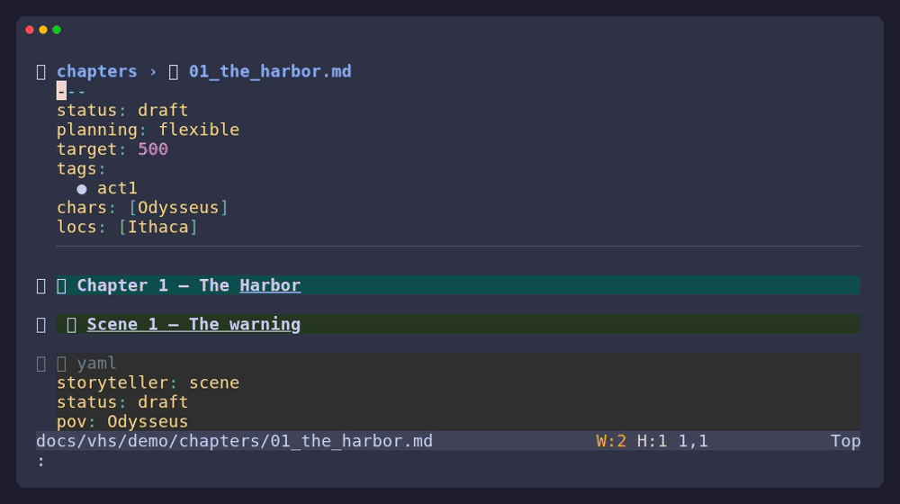
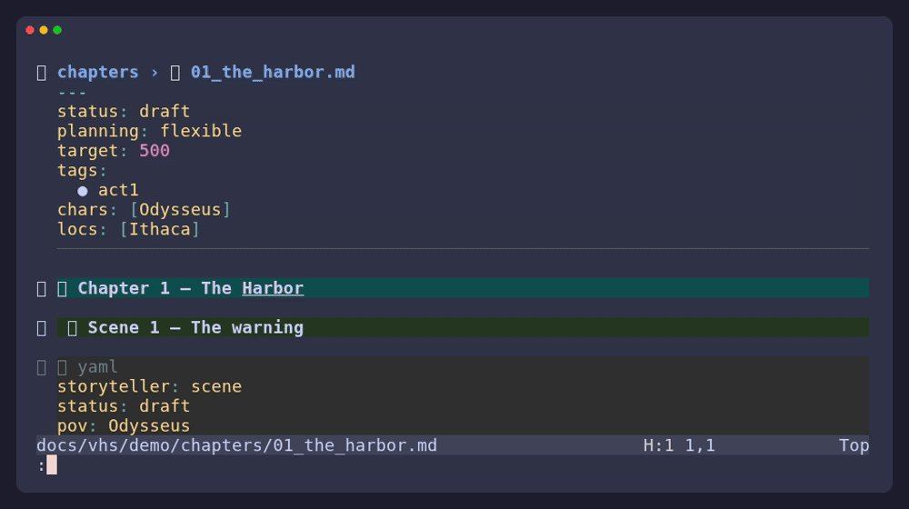
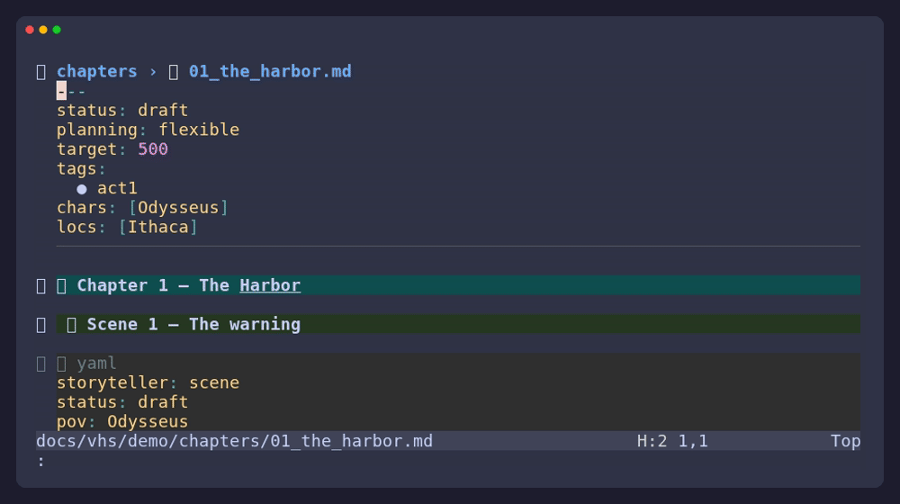

# The Storyteller User Guide

Storyteller is a set of writing tools for Neovim, not a new place to store
your writing. Chapters, notes, cards, and planning documents remain files you
can open, search, edit, version, or move without the plugin.

This guide starts with the everyday workflow and then explains the features you
can reach for when a project grows.

## Start A Project

Storyteller finds a project from any of these signals:

- A `.storyteller` file.
- A `chapters/` or `references/` directory.
- A git root.

For a new project, create a small layout and add the marker:

```bash
mkdir -p my-story/{chapters,references/characters,references/locations}
touch my-story/.storyteller
```

There is no required directory tree. These folders are a useful starting point:

| Folder | Use it for |
| --- | --- |
| `chapters/` | One Markdown file per chapter. |
| `references/` | Character, location, item, and other cards. |
| `outline/` | Overview, beats, and structural experiments. |
| `research/` | Notes and the ideas inbox. |
| `build/` | Generated manuscripts and exports. |

Files and folders beginning with `_` are ignored by indexing and export. This
makes `chapters/_cuts/` a convenient place to keep material you are not ready
to delete.

## Write Chapters

Write ordinary Markdown. A chapter is a file in `chapters/`; a scene is a
`##` heading inside that file.

````markdown
# Chapter 1 — The Harbor

## The warning

```yaml
storyteller: scene
status: draft
pov: Odysseus
location: Ithaca
goal: Convince the council to leave
conflict: The storm closes the harbor
outcome: The council refuses
```

The rain had not stopped for a week.
````

The `storyteller: scene` line tells Storyteller exactly where the metadata
block begins. A scene's fields override matching chapter frontmatter; fields
that are not present use Storyteller's normal defaults.

Chapter frontmatter is useful for values shared by every scene:

```yaml
---
status: draft
target: 5000
tags:
  - act1
---
```

Use `:Story status` to cycle a scene through `outline`, `draft`, `revision`,
`done`, and `unused`. Use `:Story meta` for a small editable metadata buffer;
write that buffer to update the scene block safely.

### Older Metadata

If a chapter still uses inline bullets such as `- **POV:** Odysseus`,
Storyteller can read them. Run `:Story migrate` when you are ready to convert
them to scene YAML.

## Find Your Place

The dashboard is the main doorway: `:Story` or `<leader>s`.

- `:Story resume` returns to the last scene you visited.
- `:Story scenes` lets you search every scene.
- `:Story next` and `:Story prev` move through the manuscript.
- `:Story outline` shows chapters, word counts, and target progress.
- `:Story corkboard` turns scenes into temporary, movable-feeling cards for
  review.
- `:Story workspace` surrounds the current buffer with a chapter/scene binder
  and a scene inspector.



The corkboard is a view of your files, not a second copy of them. Press `<CR>`
to open a scene, `a` to cycle its status, `u` to mark it unused, `R` to rebuild
the board, and `q` to close it.



## Keep A Story Bible

A reference card is a Markdown file below `references/<type>/`. The card title
and its `names:` aliases are enough for Storyteller to recognize it:

```markdown
---
names:
  - Odysseus
  - Ody
---

## Odysseus

- **Role:** protagonist
- **Core want:** return home
```

Use `:Story references` to browse cards. Select a name in visual mode and run
`:Story capture [type]` to create a card without changing the prose around it.
`:Story detect` scans the project for confident matches; `:Story detect scene`
reviews suggestions for the scene under the cursor.

Reference folders are open-ended. `references/creatures/`, `references/lore/`,
or any other subfolder becomes a usable reference type without configuration.
The folder name becomes the scene metadata list, such as `creatures:` or
`lore:`.

## Read The Manuscript

`:Story compile` opens a continuous, editable manuscript made from your
chapters. Edit it like any other buffer; saving writes changed chapters back to
their source files. Use `:Story compile!` to rebuild the view from disk.



When you want a clean reading or export copy:

- `:Story manuscript` writes `build/manuscript.md` without chapter frontmatter
  or scene metadata.
- `:Story export [fmt]` sends that manuscript through Pandoc. Supported formats
  are `docx` (the default), `epub`, `pdf`, and `smf`.
- `:Story export all [fmt]` exports chapters individually.

Generated files go in `build/`; source chapters are not modified by export.
PDF export requires a LaTeX engine in addition to Pandoc.

## Capture Ideas

`:Story idea` adds a dated bullet to `research/ideas.md`, and `:Story ideas`
opens that inbox. Ideas stay separate from chapter prose and do not affect word
counts.

## See Progress

`:Story track` opens a dashboard with total words, chapter progress, a daily
heatmap, current and longest streaks, and milestones.


Record a session with `:Story session start` and `:Story session end`.
Storyteller stores daily totals in `progress.log` and avoids counting the same
day twice.

Before a risky revision, use `:Story snapshot before-act-two`. A snapshot is a
git commit whose subject starts with `storyteller:snapshot`; it creates no
duplicate project files. Snapshots require a git repository, and Storyteller
can offer to initialize one.

## Try A Structure

`:Story template` includes five starting points:

- Three Act
- Hero's Journey
- Save the Cat
- Story Circle
- Seven Point

The preview shows what will be created before you apply it. Applying a template
is idempotent and never overwrites an existing chapter.

## Use The Language Server

The optional `storyteller-lsp` companion brings reference-aware behavior into
the prose buffer. It understands bare names, so a sentence like “Odysseus
watched the harbor” can connect to a card without `[[wikilinks]]` or special
syntax.

| Action | Typical key | Result |
| --- | --- | --- |
| Go to definition | `gd` | Open the matching reference card. |
| Hover | `K` | Show the card's type and summary. |
| References | `gr` | Find every mention across chapters. |
| Rename | `<leader>lr` | Rename the primary name in its card and prose. |
| Completion | `<C-n>` / `<Tab>` | Suggest names and metadata values. |
| Document outline | `<leader>o` | List scene headings in the chapter. |
| Code actions | `<leader>la` | Create cards, link references, or update scene metadata. |

See the [language server guide](language-server.md) for setup and the complete
feature list.

## Keymaps

Storyteller's default mappings live under `<leader>s`:

| Key | Action |
| --- | --- |
| `<leader>s` | Dashboard |
| `<leader>so` | Outline |
| `<leader>sb` | Corkboard |
| `<leader>sc` | Compile |
| `<leader>st` | Tracking |
| `<leader>sd` | Detect references |
| `<leader>sr` | Browse cards, or create one from a visual selection |
| `<leader>sm` | Edit scene metadata |
| `<leader>ss` | Cycle scene status |
| `<leader>sl` | Resume last scene |
| `<leader>sn` / `<leader>sp` | Next / previous scene |
| `<leader>se` | Export |
| `<leader>sT` | Story template |
| `<leader>sw` | Workspace |
| `<leader>si` | Capture an idea |

Every action is also available through `:Story`; use `:Story palette` when you
cannot remember a keymap.

## Configure It

```lua
require("storyteller").setup({
  picker = "auto",          -- "auto" | "telescope" | "fzf"
  ui = "auto",              -- "auto" | "morph" | "nui" | "buffer"
  detect_on_save = true,
  detect_debounce = 300,
  heatmap_weeks = 30,
})
```

The plugin has no required dependencies. `nui.nvim` and the picker backends
improve the presentation and navigation when installed, while plain buffers
remain available as a fallback. `pandoc` is only needed for export.

For custom fields, statuses, reference types, and diagnostics, read the
[schema reference](schema.md).

## Troubleshooting

**“Not in a storytelling project”**

Open a file below a project with `chapters/` or `references/`, or add a
`.storyteller` marker.

**No scene cards appear**

Add `##` scene headings. A chapter without headings still counts toward word
totals, but it has no individual scenes to display.

**A reference is not found**

Keep its card below `references/<type>/`, give it a heading, and add alternate
names to `names:`. Save a chapter or run `:Story detect scene` again.

**The continuous manuscript looks stale**

Run `:Story compile!` to rebuild it from the chapter files.

**Export fails**

Install Pandoc. PDF export also needs a LaTeX engine.

**Snapshots do nothing**

Snapshots need git. Initialize the project with `git init` or accept
Storyteller's offer to do so.
