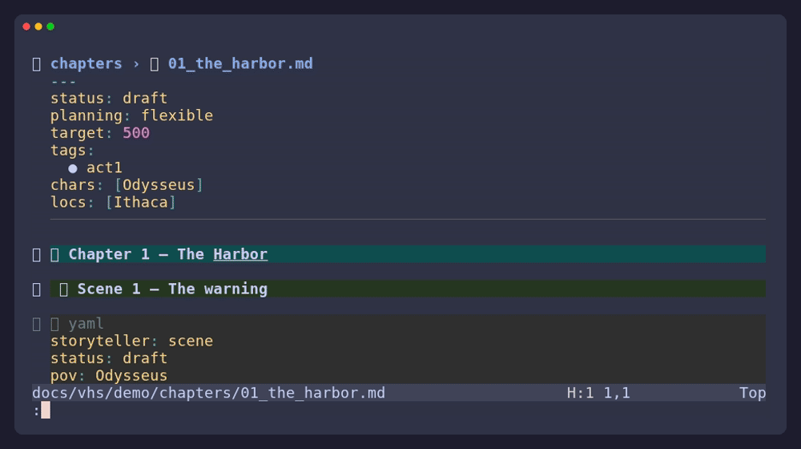
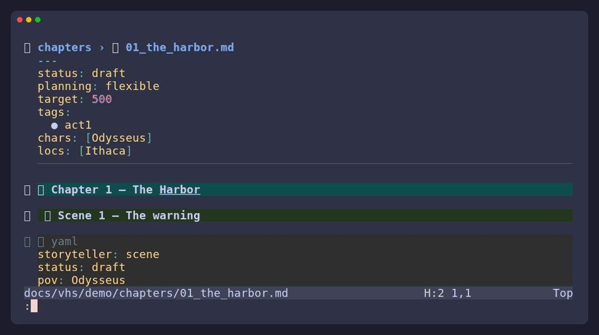
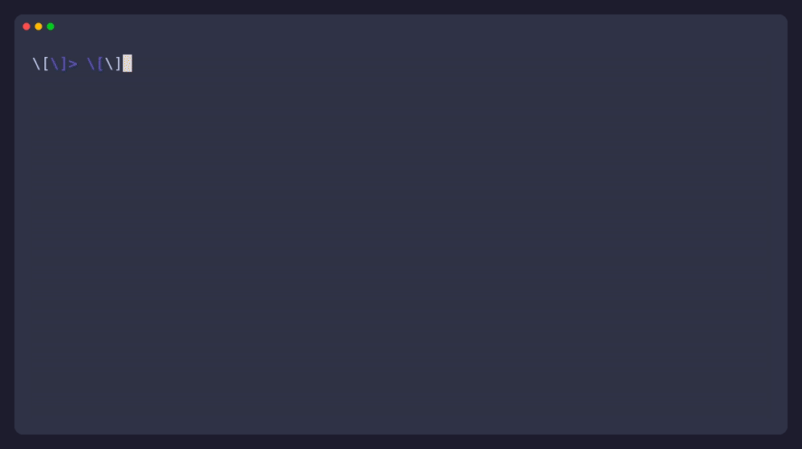
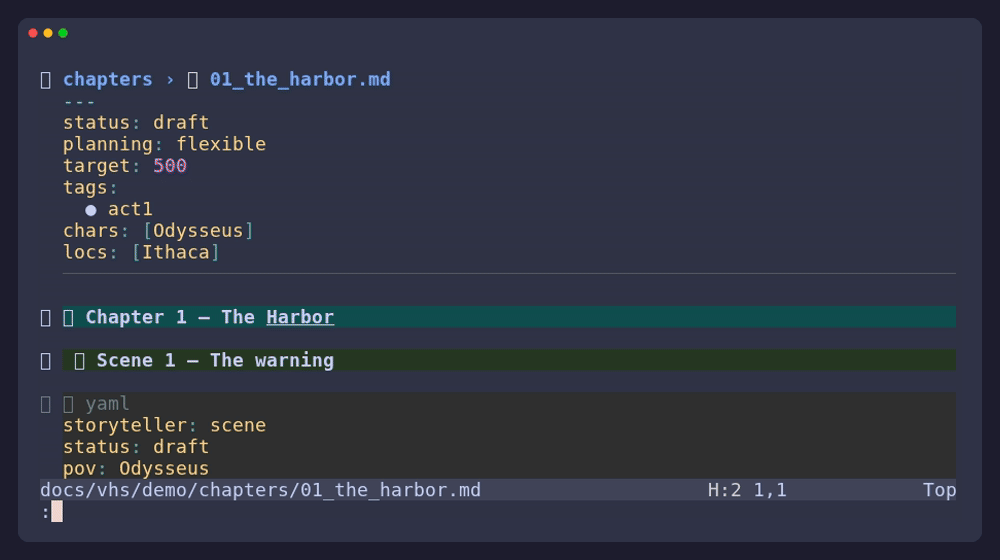

# The Storyteller User Guide

Storyteller is a set of writing tools for Neovim, not a new place to store
your writing. Chapters, notes, cards, and planning documents remain files you
can open, search, edit, version, or move without the plugin.

This guide starts with the everyday workflow and then explains the features you
can reach for when a project grows.

The visual workspace includes a project home, a GitHub-like writing activity
view, a card-based corkboard, a story timeline, a plot-thread planner, and a
story-health review. Each is a view over the same Markdown files, not a second
project database.

## Start A Project

Storyteller finds a project from any of these signals:

- A `.storyteller` file.
- A `chapters/` or `references/` directory.
- A git root.

For a new project, create a small layout and add the marker:

```bash
mkdir -p my-story/{chapters,references/characters,references/locations}
touch my-story/.storyteller
```

There is no required directory tree. These folders are a useful starting point:

| Folder | Use it for |
| --- | --- |
| `chapters/` | One Markdown file per chapter. |
| `references/` | Character, location, item, and other cards. |
| `outline/` | Overview, beats, and structural experiments. |
| `research/` | Notes and the ideas inbox. |
| `build/` | Generated manuscripts and exports. |

Files and folders beginning with `_` are ignored by indexing and export. This
makes `chapters/_cuts/` a convenient place to keep material you are not ready
to delete.

## Write Chapters

Write ordinary Markdown. A chapter is a file in `chapters/`; a scene is a
`##` heading inside that file.

````markdown
# Chapter 1 — The Harbor

## The warning

```yaml
storyteller: scene
status: draft
pov: Odysseus
location: Ithaca
goal: Convince the council to leave
conflict: The storm closes the harbor
outcome: The council refuses
```

The rain had not stopped for a week.
````

The `storyteller: scene` line tells Storyteller exactly where the metadata
block begins. A scene's fields override matching chapter frontmatter; fields
that are not present use Storyteller's normal defaults.

Chapter frontmatter is useful for values shared by every scene:

```yaml
---
status: draft
target: 5000
tags:
  - act1
---
```

Use `:Story status` to cycle a scene through `outline`, `draft`, `revision`,
`done`, and `unused`. Use `:Story meta` for a small editable metadata buffer;
write that buffer to update the scene block safely.

### Older Metadata

If a chapter still uses inline bullets such as `- **POV:** Odysseus`,
Storyteller can read them. Run `:Story migrate` when you are ready to convert
them to scene YAML.

## Find Your Place

The dashboard is the main doorway: `:Story` or `<leader>s`.

- `:Story resume` returns to the last scene you visited.
- `:Story scenes` lets you search every scene.
- `:Story next` and `:Story prev` move through the manuscript.
- `:Story outline` shows chapters, word counts, and target progress.
- `:Story corkboard` turns scenes into cards you can edit in place.
- `:Story timeline` lays scenes out by numeric story day/time when available.
- `:Story synopsis` is an editable synopsis outliner.
- `:Story metasheet` bulk-edits scene metadata (visual block shines here).
- `:Story threads` follows setup fields to their matching payoffs.
- `:Story health` gathers gentle prompts for scenes and threads worth revisiting.
- `:Story workspace` surrounds the current buffer with a chapter/scene binder
  and a scene inspector.
- `:Story annotations` reviews notes captured from your prose.
- `:Story collections` runs saved searches over scenes.


## Storyboards

The corkboard, timeline, synopsis, and metadata sheet are **storyboards**:
editable text projections of your project (see `docs/projections.md`). You
edit them like any buffer — `dd`/`p` move cards, `/` searches, visual block
sweeps the metasheet — and `:w` applies your edits to the Markdown sources
atomically. A git snapshot is taken first when the project is a repository,
so `:Story diff` is always your undo.

The corkboard is a view of your files, not a second copy of them. Press `<CR>`
to open a scene, `a` to cycle its status (staged until `:w`), `R` to re-render
from disk, and `q` to close.


Each corkboard card keeps the useful context nearby: file, status, POV,
location, beat, and word count. A card's `file:` line is its address — edit
it (and/or move the card) to relocate a scene across chapter files.

### Restructure With J And K

The corkboard is also where you restructure. Put the cursor anywhere on a card
and press `J` to move that scene later in the story or `K` to move it earlier.
The edit is staged in the buffer; on `:w` Storyteller rewrites the underlying
Markdown — heading, metadata block, and prose travel together — and re-renders
the board.

- Moving within a chapter swaps the two scene blocks.
- Moving across a chapter boundary relocates the whole scene into the
  neighboring chapter at the right position.
- Applying is atomic: if any touched buffer has unsaved edits, the apply is
  refused and the buffer is made read-only instead of being clobbered.

This is the Scrivener drag-and-drop loop — see the board, feel the order,
adjust it — without leaving the keyboard, and with the full editor (macros,
`:g`, visual block) available on the board itself.



## Follow The Story

### Timeline

`:Story timeline` is a chronology view for scenes that use `day:` or numeric
`time:` metadata. Numeric values are ordered; free-form values such as `after
the storm` remain in manuscript order rather than being guessed. Edit the day
cell (or press `J`/`K` to shift ±1 day) and `:w` retimes the scene.

Axes are first-class: a card under `references/timelines/` (with an optional
`order:` sequence and `unit:` label) declares another axis. Open it with
`:Story timeline <axis>` — scenes that declare `timeline: <axis>` ride it, and
`also:` placements appear as read-only rows marked with `*` (edit those in the
scene YAML).



### Plotlines

A track card under `references/plotlines/` declares a lane: its `stages:`
sequence orders the story's progress, and scenes attach by listing the name
under `plotlines:` in their YAML. The TUI's Plotlines tab shows each lane in
manuscript order with stage pills, marks stage regressions, lists stages no
scene has reached, and degrades to setup/payoff threads when no track cards
exist (`v` switches modes, `p` overlays a read-only stage grid).



### Plot Threads

`:Story threads` groups matching `setup:` and `payoff:` values. Complete threads
are shown separately from threads that still need a setup or payoff. Select a
thread row to open its first related scene.



### Story Health

`:Story health` is a quiet revision checklist. It can surface a goal without a
conflict, a conflict without an outcome, scenes over their target, scenes with
no story time, and unresolved plot threads. These are prompts, not blockers for
a first draft.


## Keep A Story Bible

A reference card is a Markdown file below `references/<type>/`. The card title
and its `names:` aliases are enough for Storyteller to recognize it:

```markdown
---
names:
  - Odysseus
  - Ody
---

## Odysseus

- **Role:** protagonist
- **Core want:** return home
```

Use `:Story references` to browse cards. Select a name in visual mode and run
`:Story capture [type]` to create a card without changing the prose around it.
`:Story detect` scans the project for confident matches; `:Story detect scene`
reviews suggestions for the scene under the cursor.

Reference folders are open-ended. `references/creatures/`, `references/lore/`,
or any other subfolder becomes a usable reference type without configuration.
The folder name becomes the scene metadata list, such as `creatures:` or
`lore:`.

## Read The Manuscript

`:Story compile` opens a continuous, editable manuscript made from your
chapters. Edit it like any other buffer; saving writes changed chapters back to
their source files. Use `:Story compile!` to rebuild the view from disk.


When you want a clean reading or export copy:

- `:Story manuscript` writes `build/manuscript.md` without chapter frontmatter
  or scene metadata.
- `:Story export [fmt]` sends that manuscript through Pandoc. Supported formats
  are `docx` (the default), `epub`, `pdf`, and `smf`.
- `:Story export all [fmt]` exports chapters individually.

Generated files go in `build/`; source chapters are not modified by export.
PDF export requires a LaTeX engine in addition to Pandoc.

### Compile Presets

A preset controls what gets compiled and how Pandoc is invoked. Create
`.storyteller/compile.json`:

```json
{
  "include_statuses": ["done", "revision"],
  "pandoc_args": ["--toc", "--top-level-division=chapter"],
  "title": "The Harbor"
}
```

- `include_statuses` compiles only scenes whose `status:` is listed — your
  draft stays messy while the build stays clean.
- `pandoc_args` are appended to every `:Story export` invocation.
- `title` seeds the Fountain title page.

### Other Formats And Migrations

- `:Story fountain` writes `build/manuscript.fountain`: chapters become
  section headings, scenes become forced Fountain sluglines, and metadata is
  stripped — a starting point for screenwriting tools.
- `:Story import /path/to/project.scrivx` imports a Scrivener project
  (best effort): binder documents become chapter files with scene headings,
  and RTF formatting is reduced to plain prose. Review the result before
  continuing work in it.

## Focus: Composition Mode

When it is time to write rather than manage, `<leader>sz` (`:Story compose`)
dims the screen and centers the current buffer in a narrow column with
wrapping, line breaking, and spelling enabled. Editing works exactly as
before; `<Esc>` or `:Story compose` again restores your layout.


## Capture Ideas

`:Story idea` adds a dated bullet to `research/ideas.md`, and `:Story ideas`
opens that inbox. Ideas stay separate from chapter prose and do not affect word
counts.

## Leave Notes, Not Clutter

Revision thoughts should not live inside the prose you will later export.
Storyteller keeps annotations in their own Markdown document — by default
`notes/annotations.md` — and links each one back to the line it came from.

To capture one, select the passage (or just leave the cursor on its line) and
press `<leader>sN`, or run `:Story note Sharpen this beat`. Storyteller appends
a section like this:

```markdown
## Sharpen this beat

```yaml
storyteller: note
status: open
file: chapters/01_the_harbor.md
line: 24
created: 2026-08-21
```

> At noon the coast vanished behind a wall of weather.

Something should be lost here so the crossing feels paid for.
```

The quoted text is how a note finds its way home: jump resolution searches
near the recorded line for the quote, so notes survive ordinary editing that
shifts line numbers.

Open the review board with `:Story annotations` (`<leader>sa`):

- `<CR>` jumps to the source passage.
- `r` toggles a note between `open` and `resolved`.
- `d` deletes the note after confirmation.
- `e` opens `notes/annotations.md` directly — it is plain Markdown, so you can
  reorganize, expand, or rewrite notes however you like.

Because the notes document lives outside `chapters/`, exports never see it,
and nothing needs stripping from the manuscript. Legacy inline `%%comments%%`
are still stripped on compile and still appear in the review board under a
"legacy" section so you can find and convert them.


## Saved Searches

Collections are named queries over the scene index, stored in
`.storyteller/collections.json`. Open them with `:Story collections`
(`<leader>sC`), press `n` to save a new one, `<CR>` to run it.

The query language is whitespace-separated tokens:

| Token | Matches |
| --- | --- |
| `status:draft` | Scene status (`outline`, `draft`, …). |
| `pov:Anna` | The scene's POV (partial match). |
| `loc:harbor` | Location metadata. |
| `char:odysseus` | Any entry in the `chars:` list. |
| `tag:act1` | Any tag. |
| `thread:storm` | Scenes whose `setup:` or `payoff:` mention the key. |
| `chapter:two` | Chapter title substring. |
| `storm` (bare word) | Substring of the scene title. |

Tokens combine with AND semantics: `status:draft tag:war` finds draft scenes
tagged for the war. For one-off queries skip the saving step:

```
:Story collect status:revision pov:Penelope
```


## See Progress

`:Story track` opens a dashboard with total words, chapter progress, a daily
heatmap, current and longest streaks, and milestones.


Record a session with `:Story session start` and `:Story session end`.
Storyteller stores daily totals in `progress.log` and avoids counting the same
day twice.

Before a risky revision, use `:Story snapshot before-act-two`. A snapshot is a
git commit whose subject starts with `storyteller:snapshot`; it creates no
duplicate project files. Snapshots require a git repository, and Storyteller
can offer to initialize one.

Snapshots are most useful when you can see what changed since:

- `:Story snapshots` lists them; `<CR>` on one opens a change summary.
- `:Story diff` diffs the working tree against the most recent snapshot.
- `:Story diff before` matches a snapshot by substring and diffs against it.

The summary view lists every file changed since the snapshot with its diff
stat; `<CR>` on a file opens a two-way vimdiff — snapshot version on the left,
current prose on the right.


## Try A Structure

`:Story template` includes five starting points:

- Three Act
- Hero's Journey
- Save the Cat
- Story Circle
- Seven Point

The preview shows what will be created before you apply it. Applying a template
is idempotent and never overwrites an existing chapter.

## Use The Language Server

The optional `storyteller-lsp` companion brings reference-aware behavior into
the prose buffer. It understands bare names, so a sentence like “Odysseus
watched the harbor” can connect to a card without `[[wikilinks]]` or special
syntax.

| Action | Typical key | Result |
| --- | --- | --- |
| Go to definition | `gd` | Open the matching reference card. |
| Hover | `K` | Show the card's type and summary. |
| References | `gr` | Find every mention across chapters. |
| Rename | `<leader>lr` | Rename the primary name in its card and prose. |
| Completion | `<C-n>` / `<Tab>` | Suggest names and metadata values. |
| Document outline | `<leader>o` | List scene headings in the chapter. |
| Code actions | `<leader>la` | Create cards, link references, or update scene metadata. |

See the [language server guide](language-server.md) for setup and the complete
feature list.

## Keymaps

Storyteller's default mappings live under `<leader>s`:

| Key | Action |
| --- | --- |
| `<leader>s` | Dashboard |
| `<leader>so` | Outline |
| `<leader>sb` | Corkboard |
| `<leader>sy` | Timeline |
| `<leader>sf` | Plot threads |
| `<leader>sh` | Story health |
| `<leader>sc` | Compile |
| `<leader>st` | Tracking |
| `<leader>sd` | Detect references |
| `<leader>sr` | Browse cards, or create one from a visual selection |
| `<leader>sm` | Edit scene metadata |
| `<leader>ss` | Cycle scene status |
| `<leader>sl` | Resume last scene |
| `<leader>sn` / `<leader>sp` | Next / previous scene |
| `<leader>se` | Export |
| `<leader>sT` | Story template |
| `<leader>sw` | Workspace |
| `<leader>si` | Capture an idea |
| `<leader>sa` | Review annotations |
| `<leader>sN` | Capture a note from the selection |
| `<leader>sC` | Collections |
| `<leader>sz` | Composition mode |

Every action is also available through `:Story`; use `:Story palette` when you
cannot remember a keymap.

## Configure It

```lua
require("storyteller").setup({
  picker = "auto",          -- "auto" | "telescope" | "fzf"
  tui_bin = "storyteller-tui", -- the cockpit binary for :Story tui
  tui_theme = nil,          -- "dark" | "light" | "midnight" | "forest" | "contrast"
  tui_glyphs = nil,         -- "safe" | "nerd" (nerd ships later)
  detect_on_save = true,
  detect_debounce = 300,
  heatmap_weeks = 30,
  notes_file = "notes/annotations.md",
})
```

The plugin has no required Lua dependencies. The picker backends improve the
presentation and navigation when installed, while plain buffers remain
available as a fallback. `pandoc` is only needed for export, and
`storyteller-tui` only for `:Story tui`.

`:Story tui` passes your colorscheme's background to the cockpit, so its
palette follows the editor by default; pin a preset with `tui_theme`. See
[`tui/README.md`](../tui/README.md) for the preset gallery and flags.

Every open view refreshes itself when you save a file, so numbers on the
dashboard, outline, and corkboard never go stale mid-session.

For custom fields, statuses, reference types, and diagnostics, read the
[schema reference](schema.md).

## Troubleshooting

**“Not in a storytelling project”**

Open a file below a project with `chapters/` or `references/`, or add a
`.storyteller` marker.

**No scene cards appear**

Add `##` scene headings. A chapter without headings still counts toward word
totals, but it has no individual scenes to display.

**A reference is not found**

Keep its card below `references/<type>/`, give it a heading, and add alternate
names to `names:`. Save a chapter or run `:Story detect scene` again.

**The continuous manuscript looks stale**

Run `:Story compile!` to rebuild it from the chapter files.

**Export fails**

Install Pandoc. PDF export also needs a LaTeX engine.

**Snapshots do nothing**

Snapshots need git. Initialize the project with `git init` or accept
Storyteller's offer to do so.
