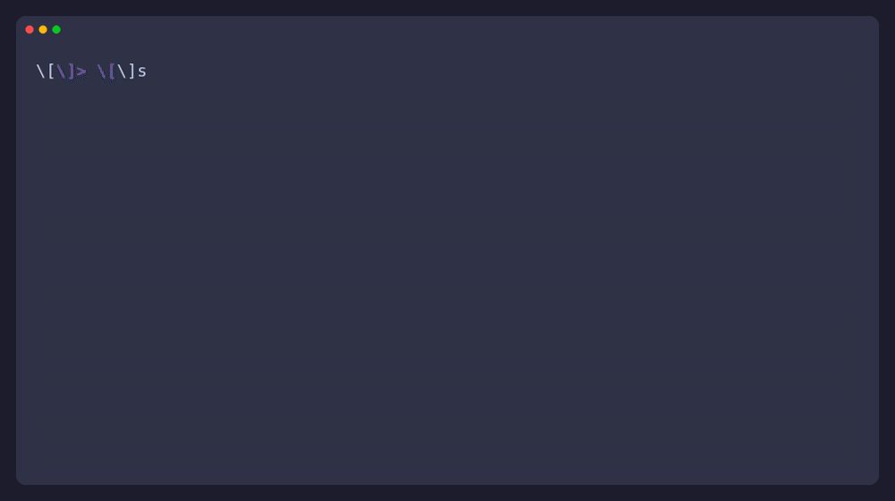

# storyteller-tui

The keyboard-first cockpit for Storyteller projects: a ratatui app that
mirrors the project's shape — dashboard, corkboard, timeline — with the same
grammar as the Neovim plugin (`docs/interaction.md`). Structural editing
lives in the editor's storyboards; `o` hands the focused scene to `$EDITOR`.



## Build & run

```bash
cargo build --release          # from tui/
./target/release/storyteller-tui ~/books/the-odyssey
```

Or via the flake: `nix run .#storyteller-tui -- path/to/project`.
Inside Neovim, `:Story tui` embeds it in a terminal buffer and passes your
colorscheme's background automatically.

## Flags

| Flag | Values | Meaning |
| --- | --- | --- |
| `--theme <id>` | `dark` `light` `midnight` `forest` `contrast` | Palette preset (§4.2 of the visual plan). Wins over everything. |
| `--background <bg>` | `dark` `light` | Picks `dark` or `light`; overridden by `--theme`. |
| `--glyphs <tier>` | `safe` `ascii` `nerd` | Icon tier: safe symbols by default, ASCII under monochrome, Nerd Font tables behind `nerd`. |
| `[path]` | directory | Project root; defaults to `$PWD`. |

## Presets

| Preset | Character |
| --- | --- |
| `dark` (default) | calm slate, cyan-teal accent (one-dark flavored) |
| `light` | warm paper tones, darker accents |
| `midnight` | deep blue-violet (tokyo-night flavored) |
| `forest` | muted green surfaces, amber accent |
| `contrast` | pure ANSI-16 mapping; works in any terminal |

Every preset stores truecolor hex and degrades automatically to ANSI-256 →
ANSI-16 → modifiers-only via capability detection at startup
(`termprofile`). Structure is identical at every tier.

## Neovim integration

```lua
require("storyteller").setup({
  tui_theme = "midnight",   -- passed as --theme (:Story tui)
  tui_glyphs = "safe",      -- passed as --glyphs
})
```

`:Story tui` also passes `--background` derived from `vim.o.background`, so
the cockpit follows your editor's palette by default.

## Tests

```bash
cargo test    # parser + TestBackend matrix: breakpoints, footer bindings,
              # glyph mapping, theme degradation snapshots
```
